# 🛡️ Awesome Identity Threat Detection & Response (ITDR)

  

  
  
  
  

> **Top Identity Threat Detection & Response (ITDR) Ecosystem**  
> A curated security list of enterprise SaaS platforms and open-source GitHub projects focused on credential compromise detection, lateral movement prevention, privilege abuse detection, and identity attack path analysis.

---

## 📚 Table of Contents
- [🌐 Market Overview & Insights](#-market-overview--insights)
- [🏢 SaaS / Hosted Platforms](#-saas--hosted-platforms)
- [🔓 Open-Source GitHub Projects](#-open-source-github-projects)
- [🤝 How to Contribute](#-how-to-contribute)
- [💖 Support & Acknowledgments](#-support--acknowledgments)
- [📈 Star History](#-star-history)
- [⚠️ Disclaimer](#-disclaimer)

---

## 🌐 Market Overview & Insights

> 💡 **Market Size & Structure:** The global **Identity Threat Detection and Response (ITDR)** market is estimated at **$3.42 Billion to $7.27 Billion** (with long-term projections exceeding $20 Billion by 2035) and is growing rapidly at a **CAGR of ~23.5%**. The sector is currently **moderately fragmented**: specialized pure-play innovators (e.g., Silverfort, Permiso, Semperis) compete alongside dominant Extended Detection and Response (XDR) & Cloud Security suites (CrowdStrike, Microsoft Defender, SentinelOne).

---

## 🏢 SaaS / Hosted Platforms

Below is a comparative breakdown of top commercial ITDR platforms, sorted by **Company Size / Valuation (Descending)**:

| Platform 🚀 | Description 📝 | Valuation / Revenue 💰 | Starting Pricing 🏷️ | Free Tier / Free Trial Limits ⏳ |
| :--- | :--- | :--- | :--- | :--- |
| **Microsoft Defender for Identity** | Cloud-based identity threat detection for Active Directory and Entra ID. Monitors signals to prevent lateral movement and credential compromise. | **~$3.1 Trillion** (Market Cap) | ~$5.50/user/month standalone (or included in M365 E5 / E5 Security at ~$57/user/month) | 30-day free trial via Microsoft 365 E5 trial evaluation account |
| **CrowdStrike Falcon Identity Protection** | AI-driven ITDR integrated into Falcon platform. Detects credential abuse, unauthorized privilege escalation, and lateral movement. | **~$241 Billion** (Market Cap) | ~$15.00/user/year base add-on module estimate | 15-day free trial of CrowdStrike Falcon platform |
| **SentinelOne Singularity Identity** | Autonomous identity security with threat detection across AD, Entra ID, and cloud endpoints. | **~$7.2 Billion** (Market Cap) | ~$6.00/endpoint/month estimate | 30-day free trial via SentinelOne Singularity platform evaluation |
| **BeyondTrust** | Privileged access management with identity threat analytics to detect anomalous admin sessions. | **~$3.0 Billion** (Valuation) | ~$1,500/year base platform entry quote | Personalized 14-day evaluation environment upon request |
| **Beyond Identity** | Passwordless MFA and continuous authentication engine preventing credential compromise and ATO. | **~$1.1 Billion** (Valuation) | ~$3.00/user/month (Secure Workforce Plan) | 30-day free trial (up to 25 users) |
| **Silverfort** | Agentless identity protection extending MFA and threat detection to legacy systems, AD, and cloud directories. | **~$1.0 Billion** (Valuation) | ~$2.50/user/month estimated enterprise tier | Free Identity Security Assessment PoC (No self-serve free trial) |
| **Semperis** | Active Directory and Entra ID identity protection, attack path remediation, and ransomware recovery. | **~$1.0 Billion** (Valuation) | ~$1,200/year base server protection package | Free Hybrid Identity Assessment Tool (Purple Knight / Forest Druid) |
| **Proofpoint Identity Threat Defense** | Identity threat detection (formerly ObserveIT) for insider threat defense and session recording. | **~$12.3 Billion** (Acquired / Private) | ~$1,200/year base license package | 14-day free trial upon request |
| **Quest One Identity** | Identity governance and privileged access management with built-in ITDR detection logic. | **~$1.5 Billion** (Segment Revenue) | ~$4.00/user/month base tier estimate | 30-day free trial download for software modules |
| **Veza** | Access graph technology mapping effective permissions to discover over-privileged access paths. | **~$500 Million** (Valuation) | ~$3.00/identity/month estimated tier | Free Access Risk Assessment PoC upon request |
| **Netwrix** | Identity and data access security detecting suspicious activity across AD and Entra ID. | **~$300 Million** (Valuation) | ~$1,350/year base configuration | 20-day full featured free trial download |
| **Permiso** | Identity threat detection for AWS, Azure, GCP, Okta, and GitHub by normalizing cross-cloud logs. | **~$150 Million** (Valuation) | ~$2.00/monitored identity/month estimate | 14-day cloud identity threat assessment evaluation |
| **Huntress Managed Identity** | Managed ITDR tailored for SMBs and MSPs monitoring Entra ID and Active Directory risks. | **~$100 Million** (Valuation) | ~$1.50/user/month (MSP tiering) | 21-day unrestricted free trial |
| **Delve Labs** | Continuous risk scoring and identity misconfiguration detection across cloud assets. | **~$20 Million** (Valuation) | ~$1,000/year starter quote | 14-day trial account upon request |

---

## 🔓 Open-Source GitHub Projects

Curated list of open-source identity security tools, frameworks, and graph mappers, sorted by **GitHub Star Count (Descending)**:

| Project 🛠️ | Description 📋 | GitHub Popularity ⭐ |
| :--- | :--- | :--- |
| **[BloodHound](https://github.com/SpecterOps/BloodHound)** | Active Directory and cloud attack path mapping tool using graph theory to reveal implicit privilege escalation paths. |  |
| **[Apache Syncope](https://github.com/apache/syncope)** | Open-source enterprise Identity Management (IAM) system covering provisioning, access management, SCIM, and governance. |  |
| **[Paralus](https://github.com/paralus/paralus)** | CNCF Sandbox project providing zero-trust, audited access management for Kubernetes clusters with dynamic permission control. |  |
| **[Identity Threat Hunter (ITH)](https://github.com/google/identity-threat-hunter)** | Cloud-native identity threat analytics platform built on GCP and Elastic with Vertex AI for impossible travel and lateral movement detection. |  |
| **[KIEMPossible](https://github.com/paloaltonetworks/kiempossible)** | Kubernetes Identity and Entitlement Management (KIEM) toolkit detecting risky RBAC permissions and token abuses. |  |
| **[AD-PathFinder](https://github.com/NetSPI/AD-PathFinder)** | Attack path mapping tool for AD, ADCS, SCCM, and MSSQL extending BloodHound with password auditing and HTML reports. |  |
| **[Idryx](https://github.com/idryx-io/idryx)** | Graph-based identity security engine unifying humans, service accounts, and AI agents with 27 detectors and least-privilege analysis. |  |
| **[Mantissa Stance](https://github.com/mantissa-stance/stance)** | Agentless Cloud Infrastructure Entitlement Management (CIEM) engine with 300+ YAML policies for AWS, GCP, and Azure attack paths. |  |
| **[Perun](https://github.com/perun-idm/perun)** | Identity & Access Management system managing user lifecycles, virtual organizations, and federated resource access. |  |
| **[bloodtrail](https://github.com/bloodtrail-io/bloodtrail)** | Active Directory attack path discovery toolkit detecting compound attack chains (WriteDACL -> DCSync) and password reuse. |  |
| **[P0LR Espresso](https://github.com/permiso-io/p0lr-espresso)** | Open framework for normalizing cloud runtime identity logs across AWS, GCP, Azure, Okta, and GitHub into unified schemas. |  |
| **[AI Access Sentinel](https://github.com/ai-access-sentinel/sentinel)** | ITDR platform featuring 6-factor risk scoring, UEBA anomaly detection, role mining, and CrowdStrike threat intel integration. |  |
| **[Open-ITDR](https://github.com/authomize/open-itdr)** | Python toolkit for identity threat detection and response detection logic by Authomize. |  |
| **[redpath](https://github.com/redpath-sec/redpath)** | Scriptable Active Directory attack path mapper calculating minimum-cost paths and SARIF output for CI integration. |  |

---

## 🤝 How to Contribute

Contributions are warmly welcomed! Help build the ultimate ITDR repository:

1. 🍴 **Fork** the repository.
2. 📝 **Add/edit** entries in `README.md` following the tabular layout and formatting.
3. 🔍 Ensure descriptions are objective and include relevant links/metrics.
4. 📥 Submit a **Pull Request** with a brief summary of your updates.

---

## 💖 Support & Acknowledgments

Thank you for visiting and supporting this open-source cybersecurity reference! 

If you find this repository helpful:
- ⭐ **Star** this repository to help others discover ITDR tools.
- 🔀 **Fork** it to contribute your own curated detection rules and security tools.
- 📢 **Share** it with your SOC team, security architects, and red/blue team colleagues!

☕ **Buy Me a Coffee / Sponsor:**  
If you'd like to support ongoing maintenance and security research, please visit the [GitHub Sponsor Dashboard](https://github.com/sponsors/ishandutta2007).

---

## 📈 Star History

---

## ⚠️ Disclaimer

This list is community-curated for educational and defensive security research purposes. It does not constitute an explicit endorsement of any tool or SaaS vendor. ITDR tools process sensitive authentication logs; ensure compliance with organizational data protection guidelines and privacy regulations.
